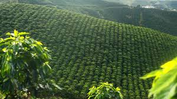
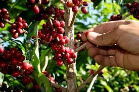
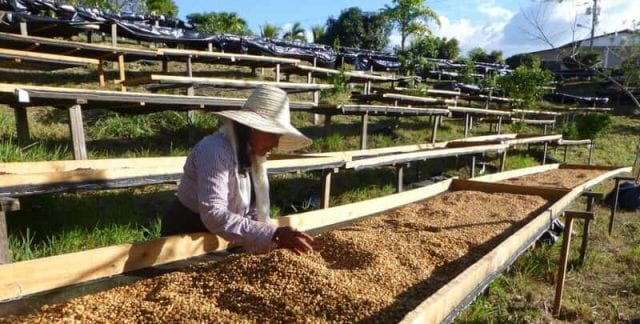
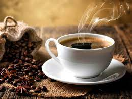
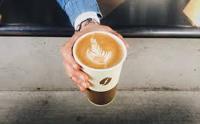
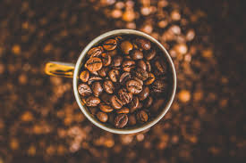
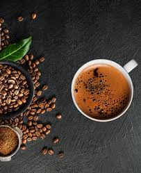
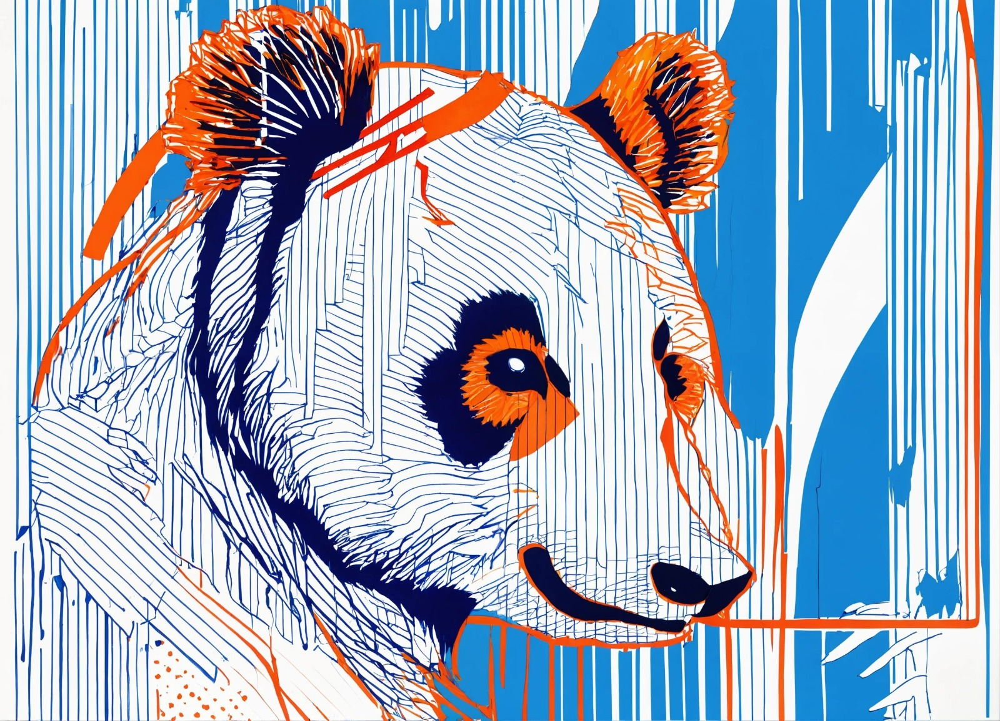
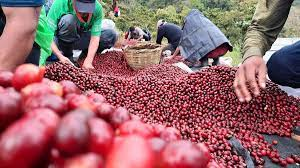
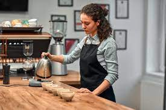

<!DOCTYPE html>
<html lang="en">

<head>
  <meta charset="UTF-8">
  <meta name="viewport" content="width=device-width, initial-scale=1.0">
  <link rel="stylesheet" href="./css/stilos1.css">
  <title>Coffe Shop</title>
</head>

<body>
  <section id="header">
    

      

        

          <a href="#hero">
            <h1>J & R</h1>
          </a>
        

        

          

            

          

          <ul>
            <li><a href="/login.html" data-after="home">registrarte</a></li>
            <li><a href="/productos.html" data-after="service">Productos</a></li>
            <li><a href="#projects" data-after="projects">Clientes</a></li>
            <li><a href="#about" data-after="About">Nosotros</a></li>
            <li><a href="#contact" data-after="contact">Contacto</a></li>

          </ul>
        

      

    

  </section>

  <section id="hero">
    

      

        <h1>Bienvenidos, </h1>
        <h1>Nosotros somos </h1>
        <h1>Panda </h1>
        <a href="#projects" type="button" class="cta">Clientes</a>
      

    

  </section>

  <section id="services">
    

      

        <h1 class="section-title">Cafequeenamora</h1>
        
Como buenos colombianos que somos, nos dimos a la tarear
          de buscar los mejores cafes, para llevar a la puerta de tu casa,
          nos enfocamos en tus necesidades y te traemos los mejores cafes
          y lo mejor de todo, con un precio accesible.
        

      

      

        

          

          <h2>Cultivos</h2>
          
vamos a los cafetales, para ver la siembra de nuestras semillas de cafe, con el compromiso
            de siempre seleccionar las mejores, para que esto lo veas reflejado con cada taza que te tomes.
          

        

        

          

          <h2>Recolecta</h2>
          
cada grano, es seleccionado uno a uno, para que este no se vea estropeado en el proceso
            seleccion, con ayuda de nuestros colaboradores, buscamos la mejor experiencia para ti.                     
          

        

        

          

          <h2>proceso</h2>
          
nos encargamos de que cada grano de cafe sea tratado muy bien, 
            ya que, un grano de cafe maltratado, dañaria todo este proceso y no podrias tener esta 
            hermosa experiencia en tu taza.
          

        

        

          

          <h2>Resultado</h2>
          
mas que una taza de cafe, es una experiencia inigualable e inrrepetible,
            mas que una taza, es una satisfaccion que no se vuelve a repetir, cada sorbo
            es diferente.
          

        

      

    

  </section>

  <section id="projects">
    

      

        <h1 class="section-title">Nuestros Clientes</h1>
      

      

        

          

            <h1>Karen Caraballo</h1>
            <h2>El cafe es amor</h2>
            
con panda, he podido disfrutar de los mejores cafes de mi tierra,
              viviendo en el extranjero, se me dificulta encontrar un cafe igual o parecido
              a los que produce mi tierra, GRACIAS PANDA
            

          

          

            
          

        

        

          

            <h1>Henry Hank</h1>
            <h2>I love coffe</h2>
            
Since I visited Colombia, I have in love with the coffe of this land,
              in my coutry New Zealand, its very difficult to find such exquisite coffe,
              ty to u, U have it at the door of my house.
            

          

          

            
          

        

        

          

            <h1>Arturo Berrocal</h1>
            <h2>Gracias</h2>
            
llevo pocos pedidos con ustedes pero debo decir, que los recomiendo
              a ojos cerrados, son puntuales, facil de pedir, gracias.
            

          

          

            
          

        

      

    

  </section>

  <section id="projects">
    

      

        <h1 class="section-title">Somos Panda</h1>
      

      

        

          

            <h1>Quienes somos?</h1>
            <h2>PANDA</h2>
            
Somos unos jovenes emprededores, que amamos el cafe y decidimos abrirnos 
              como independientes para formar nuestra propia empresa para llevar nuestro cafe 
              y marcas mas reconocidas a todo el mundo.
            

          

          

            
          

        

        

          

            <h1>PANDA</h1>
            <h2>nuestra misión</h2>
            
elevar, producir y proveer calidad de vida, mediante el suministro
              salubre y accesible, de productos y servicios, y de calidad que empoderen
              nuestras raices y patrimonio cultural, no como una opción,
              si no como una necesidad de bienestar global
            

          

          

            
          

        

        

          

            <h1>PANDA</h1>
            <h2>nuestra visión</h2>
            
Nos vemos en el tiempo; una entidad multiactiva de alcance internacional, 
              operando de por lo menos en gran parte de uno a dos continentes «Europa – América» 
              siendo una marca líder en el desarrollo e impulso al consumo masivo del café, 
              (significante colectivo de empoderamiento sociocultural), y superando la tarea 
              de llegar a ser la firma más influyente y cualificada, en alcanzar los niveles y 
              topes más salubres, accesibles, y comerciales del rubro del café y sus derivados en el mercado mundial.

          

          

            
          

        

      

    

  </section>

  <section id="about">
    

      

        

          
        

      

      

        <h1 class="section-title">Acerca de Nosotros</h1>
        <h2>Richard y Jonathan</h2>
        
Somos unos jovenes empresarios y desarolladores web
          que se nos dio la loca idea de emprender,
          aprovechando nuestras habilidades en el desarrollo de software
          hemos impulsado nuestra marca primordialmente en internet,
          escalando poco a poco hasta llegar hacer una marca reconocida.
        

      

    

  </section>

  <section id="contact">
    

      

        <h1 class="section-title">Informacion de  Contacto</h1>
      

      

        

          

          

            <h1>Telefonos</h1>
            <h2>+57 305 250 2421</h2>
            <h2>+57 310 246 7978</h2>
          

        

        

          

          

            <h1>Correo Electronico</h1>
            <h2>jonathan.tacuma@pi.edu.co</h2>
            <h2>richard.rizo@pi.edu.co</h2>
          

        

        

          

          

            <h1>Direccion</h1>
            <h2>Cartagena, Bolivar, Colombia</h2>
          

        

      

    

  </section>

  <section id="footer">
    

      

        <h1>PANDA</h1>
      

      <h2>El cafe a solo un click</h2>
      

        

          
        

      

      
Copyright © 2024 PANDA. todos los derechos reservados

    

  </section>

  
</body>

</html>
